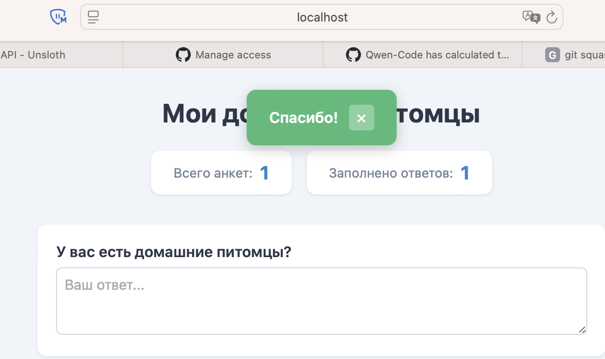
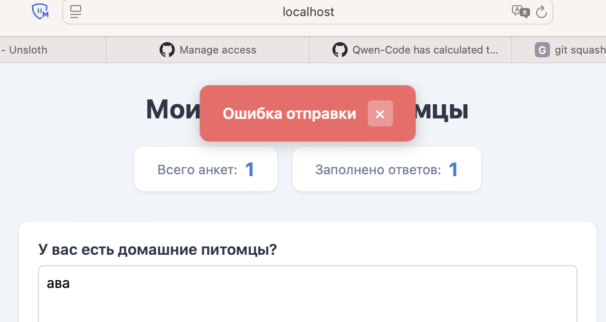

В ДЗ использовалась модель unsloth/Qwen3.6-35B-A3B-MTP-GGUF:UD-Q4_K_XL на локальном железе RTX 5070 12Gb и сервером llama.cpp

Запускался VSCode с плагином qwen-code-vscode-ide-companion, запрос выглядил так
```
Execute task @project_task.md
```
В процессе последующего тестирования была пара ошибок, вот промты
```
INFO:     127.0.0.1:54140 - "GET /static/style.css HTTP/1.1" 404 Not Found
```
```
Анкета не очищается после отправки
```
```
Счётчик Заполнено ответов должен считать все не пустые ответы в памяти backend
```
После этих правок замечаний больше не было.

Сам файл [README](readme.md) тоже был сгенерирован моделью

Скрины прилагаю

